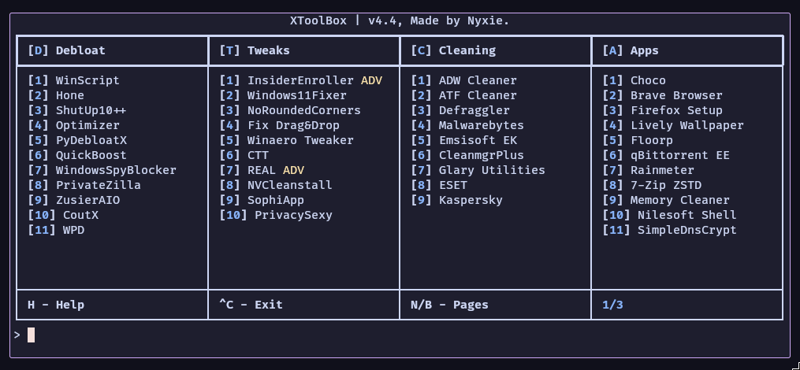
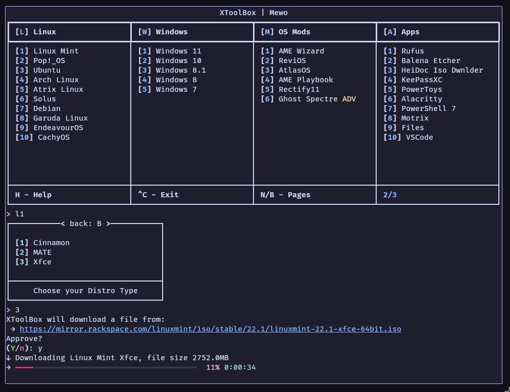

# XToolBox
A toolbox full of Windows 10/11 debloating utilities.\
Made by [Nyxie](https://nyx.fuckingbitch.eu), the project's site can be found [here](https://xtoolbox.fuckingbitch.eu).\
We also [have a Discord server](https://discord.gg/sSUzWhvB6d).

## 🚀 Quickstart
1. Press Windows + R
2. Type in `powershell` and press Enter
3. Type in `irm https://xtoolbox.fuckingbitch.eu/get | iex` and press Enter
4. You now have XToolBox running on your computer, pretty cool!

## 📑 Important
1. This program will run __ONLY__ on Windows 10 (tested on 22H2) and Windows 11 (tested on 24H2), it's not advised to use older version of Windows, like Windows 7 or Windows 8.1. If you are using these unsupported versions, please upgrade to a supported one or use Linux. I can't and won't prevent you from using XTB on an older version of Windows tho.
2. If this program gets flagged as malware, it's a false positive, here's why:
    1. It downloads and executes files.
    2. It's packed with UPX.
    3. It uses PyInstaller as a compiler.

## 📸 Screenshots




## 🖊️ Reviews
*nice toolbox*

- `jonathah#1221`

------

*Thanks bro, very useful softwhere*

- `@sennv`

------

*After using XTB my computer started having an erection*

- `@genc1337`

------

*now I get more fps in minecraft lessgooo*

- `@arxify`

------

*xtooblox made me pregnant*

- `@jamieroot`

## ⚒️ Building
- Remember to put in your UPX path, not to the exe, just to the directory!
- The building process requires [Python](https://www.python.org/downloads/) and [Git](https://git-scm.com/downloads)
```
git clone https://github.com/nyxiereal/XToolbox
pip install -r requirements.txt
pip install pyinstaller
pyinstaller --onefile --clean --upx-dir="path\to\upx\dir" main.py
```

## 🔗 Links

<a href="https://star-history.com/#nyxiereal/xtoolbox&Date">
 <picture>
   <source media="(prefers-color-scheme: dark)" srcset="https://api.star-history.com/svg?repos=nyxiereal/xtoolbox&type=Date&theme=dark" />
   <source media="(prefers-color-scheme: light)" srcset="https://api.star-history.com/svg?repos=nyxiereal/xtoolbox&type=Date" />
   
 </picture>
</a>

## ✍️ Keywords, pls ignore
input lag latency optimization performance gaming overclock oc windows ping debloat milliseconds fps boost increase decrease guide mouse tweak tweaks bios uefi pc overclocking 7 8.1 10 11 w7 w8 . w10 w11 linux game gamer optimizations frametime frametimes 0. 1080p 720p reaction time delay delayed bloat bloated debloated steam battle origin epic games quake counter strike royale br intel nvidia pascal turing ampere reflex amd ati ryzen r9 r7 r5 r3 radeon rdna core i9 i7 i5 i3 memory ram gpu ssd nvme psu power supply laptop how to screenshot on window download release date andersen blinds for pella media creation tool fast chris titus tech optimize debloater github reddit iso beebom jayztwocents script best does not work defender dell dism deutsch what mean 
